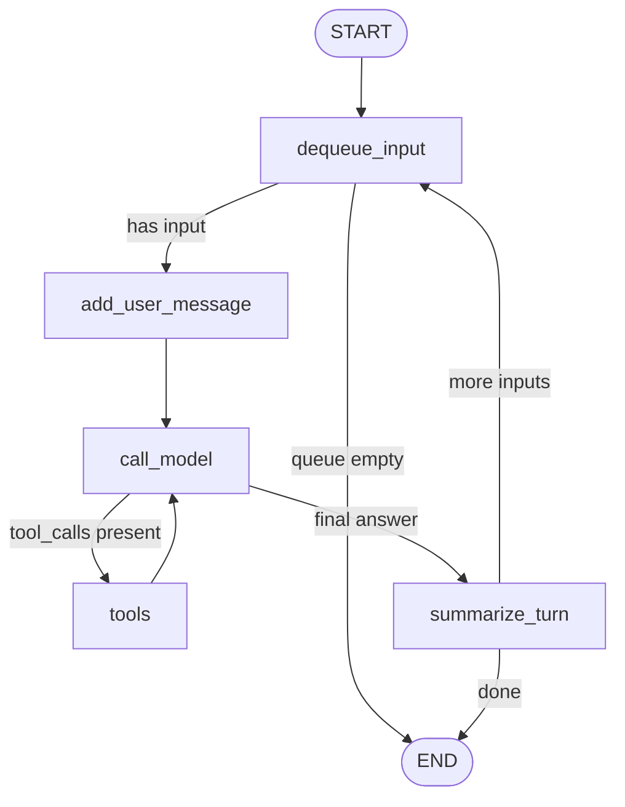

# Topic 3: Sequential vs Parallel LLM Execution with Ollama

Task1
## Results
| Execution Mode | Astronomy Duration | Business Ethics Duration | Total Wall Clock Time |
|---------------|-------------------|--------------------------|----------------------|
| Individual Run | 34.7s | 21.5s | N/A |
| Sequential | 32.9s | 21.7s | **~54.6s** |
| Parallel | 38.1s | 27.6s | **~38.1s** |


## Observations

Key Finding: Parallel Execution Provides Meaningful Speedup

Despite both programs competing for the same Ollama server resources, parallel execution reduced total wall clock time by approximately **30%** (from ~55 seconds to ~38 seconds).

Task2:
The line client = OpenAI() initializes an OpenAI client instance that handles authentication and communication with the OpenAI API using the API key stored in the environment. The call to client.chat.completions.create(...) sends a chat-style request to the GPT-4o Mini model, including a user message that instructs the model to respond with a short phrase. The messages parameter defines the conversation input, while max_tokens=5 limits the length of the model's generated output. This test verifies that the OpenAI library is correctly installed and that the API connection is functioning as expected.

---

## Task 3: Manual Tool Calling with Calculator & Geometric Functions

**File:** `manual_tool_handling.py`

This exercise demonstrates how tool calling works under the hood with OpenAI's function calling API. A custom calculator tool with geometric functions was implemented from scratch.

### Calculator Tool Features

| Category | Operations |
|----------|-----------|
| **Arithmetic** | `add`, `subtract`, `multiply`, `divide`, `power`, `sqrt`, `evaluate` |
| **2D Geometry** | `circle_area`, `circle_circumference`, `rectangle_area`, `rectangle_perimeter`, `triangle_area`, `triangle_perimeter` |
| **3D Geometry** | `sphere_volume`, `sphere_surface`, `cylinder_volume`, `cylinder_surface`, `cone_volume`, `box_volume`, `box_surface` |
| **Trigonometry** | `sin`, `cos`, `tan`, `degrees_to_radians`, `radians_to_degrees` |

### Implementation Details

- **Input parsing:** `json.loads()` to parse tool parameters
- **Output formatting:** `json.dumps()` to return structured results
- **Safe expression evaluation:** `ast` module with restricted operators (no `eval()` security risks)
- **Tool dispatch:** Dictionary-based lookup for clean function routing

### Example Output

#### TEST 4: Calculator - Basic Arithmetic
```
User: What is 15 multiplied by 7, then add 25 to the result?

--- Iteration 1 ---
LLM wants to call 1 tool(s)
  Tool: calculator
  Args: {'operation': 'add', 'params': '{"a":105,"b":25}'}
  Result: {"operation": "add", "params": {"a": 105, "b": 25}, "result": 130}

--- Iteration 2 ---
Assistant: 15 multiplied by 7 is 105. When you add 25 to that result, you get 130.
```

#### TEST 5: Calculator - Circle Geometry
```
User: I have a circular pizza with a radius of 8 inches. What is its area and circumference?

--- Iteration 1 ---
LLM wants to call 2 tool(s)
  Tool: calculator
  Args: {'operation': 'circle_area', 'params': '{"radius":8}'}
  Result: {"operation": "circle_area", "params": {"radius": 8}, "result": 201.0619298297}
  Tool: calculator
  Args: {'operation': 'circle_circumference', 'params': '{"radius":8}'}
  Result: {"operation": "circle_circumference", "params": {"radius": 8}, "result": 50.2654824574}

--- Iteration 2 ---
Assistant: The area of the circular pizza with a radius of 8 inches is approximately 
**201.06 square inches**, and its circumference is approximately **50.27 inches**.
```

#### TEST 6: Calculator - 3D Geometry (Sphere)
```
User: Calculate the volume and surface area of a sphere with radius 5 cm.

--- Iteration 1 ---
LLM wants to call 2 tool(s)
  Tool: calculator
  Args: {'operation': 'sphere_volume', 'params': '{"radius":5}'}
  Result: {"operation": "sphere_volume", "params": {"radius": 5}, "result": 523.5987755983}
  Tool: calculator
  Args: {'operation': 'sphere_surface', 'params': '{"radius":5}'}
  Result: {"operation": "sphere_surface", "params": {"radius": 5}, "result": 314.159265359}

--- Iteration 2 ---
Assistant: The volume of a sphere with a radius of 5 cm is approximately 523.60 cm³, 
and the surface area is approximately 314.16 cm².
```

#### TEST 8: Calculator - Triangle (Heron's Formula)
```
User: Find the area of a triangle with sides 3, 4, and 5 units.

--- Iteration 1 ---
LLM wants to call 1 tool(s)
  Tool: calculator
  Args: {'operation': 'triangle_area', 'params': '{"a":3,"b":4,"c":5}'}
  Result: {"operation": "triangle_area", "params": {"a": 3, "b": 4, "c": 5}, "result": 6.0}

--- Iteration 2 ---
Assistant: The area of the triangle with sides 3, 4, and 5 units is 6.0 square units.
```

#### TEST 9: Calculator - Trigonometry
```
User: What is the sine and cosine of 45 degrees?

--- Iteration 1 ---
LLM wants to call 2 tool(s)
  Tool: calculator
  Args: {'operation': 'sin', 'params': '{"angle":45,"unit":"degrees"}'}
  Result: {"operation": "sin", "params": {"angle": 45, "unit": "degrees"}, "result": 0.7071067812}
  Tool: calculator
  Args: {'operation': 'cos', 'params': '{"angle":45,"unit":"degrees"}'}
  Result: {"operation": "cos", "params": {"angle": 45, "unit": "degrees"}, "result": 0.7071067812}

--- Iteration 2 ---
Assistant: The sine of 45 degrees is approximately 0.7071, and the cosine of 45 degrees 
is also approximately 0.7071.
```

#### TEST 10: Combined Weather + Calculator
```
User: What's the weather in Tokyo? Also, if I have a rectangular garden that is 
12 meters long and 8 meters wide, what is its area and perimeter?

--- Iteration 1 ---
LLM wants to call 3 tool(s)
  Tool: get_weather
  Args: {'location': 'Tokyo'}
  Result: Clear, 65°F
  Tool: calculator
  Args: {'operation': 'rectangle_area', 'params': '{"length":12,"width":8}'}
  Result: {"operation": "rectangle_area", "params": {"length": 12, "width": 8}, "result": 96}
  Tool: calculator
  Args: {'operation': 'rectangle_perimeter', 'params': '{"length":12,"width":8}'}
  Result: {"operation": "rectangle_perimeter", "params": {"length": 12, "width": 8}, "result": 40}

--- Iteration 2 ---
Assistant: The current weather in Tokyo is clear, with a temperature of 65°F. 

For your rectangular garden:
- The area is 96 square meters.
- The perimeter is 40 meters.
```

### Key Observations

1. **Parallel Tool Calls:** The LLM intelligently calls multiple tools in a single iteration when needed (e.g., both `circle_area` and `circle_circumference` together)
2. **Multi-Tool Queries:** The agent handles queries requiring both weather and calculator tools seamlessly
3. **Heron's Formula:** Triangle area can be calculated with either base+height or three sides
4. **JSON I/O:** Clean structured input/output using `json.loads()` and `json.dumps()`

---

## Task 4: Extended Manual Tool Calling (Letter Count + Custom Tool)

**File:** `manual_tool_handling_task4.py`

Additions completed:

- Added `count_letter_occurrences` tool for prompts like "How many s are in Mississippi riverboats?"
- Added custom third tool `text_insights` (character count, word count, longest word)
- Refactored tool execution into centralized dispatch via `TOOL_HANDLERS` + `execute_tool_call()`

Terminal output artifacts saved for portfolio:

- `task4_terminal_output_custom_tool_cases.txt` (multiple custom tool prompts)

---

## Task 5: LangGraph Single Long Conversation + Checkpoint Recovery

**File:** `task5.py`

This task rewrites the manual loop into a LangGraph workflow that executes one long multi-turn conversation in a single graph run. The graph uses `ToolNode` for tool execution and a checkpoint backend for state persistence and recovery.

### Mermaid Diagram



### Checkpoint and Recovery Notes

- Threaded checkpoints are keyed by `thread_id`
- Recovery demo intentionally interrupts after turn 1, then resumes from the same `thread_id`
- Resume continues from saved graph state (remaining queued user inputs + message history)

### Portfolio Trace Files

- `task5_terminal_output_full_and_recovery.txt`
- `task5_mermaid_diagram.mmd`

### Example Evidence: Context + Tool Use

From the captured run:

- Turn 2 counts `'s'` in `"Mississippi riverboats"`
- Turn 3 asks to count `'i'` in "the same phrase" and compute sine of the difference
- The agent reuses context and executes multiple tools (`count_letter_occurrences`, `calculator`) before finalizing

### Example Evidence: Recovery

From the captured run:

- Recovery demo prints `Interrupted. Remaining queued inputs: 3`
- A resumed run with the same thread continues at Turn 2
- Finishes with `Recovered and completed. Remaining queued inputs: 0`

### Parallelization Opportunity Not Yet Used

An opportunity is in the tool phase for independent requests in the same turn. In the current graph (`call_model -> tools -> call_model`), the model sometimes issues one tool call at a time across repeated cycles (for example, repeated `calculator` calls in the recovery trace), which serializes work and increases latency. A better strategy would be to aggregate independent tool intents in one model response and execute them together (or fan out into parallel tool-execution branches), then merge results before the next reasoning step. This keeps dependency-sensitive steps sequential, while parallelizing independent subproblems like counting multiple letters or running unrelated weather/text-stat queries in the same turn.